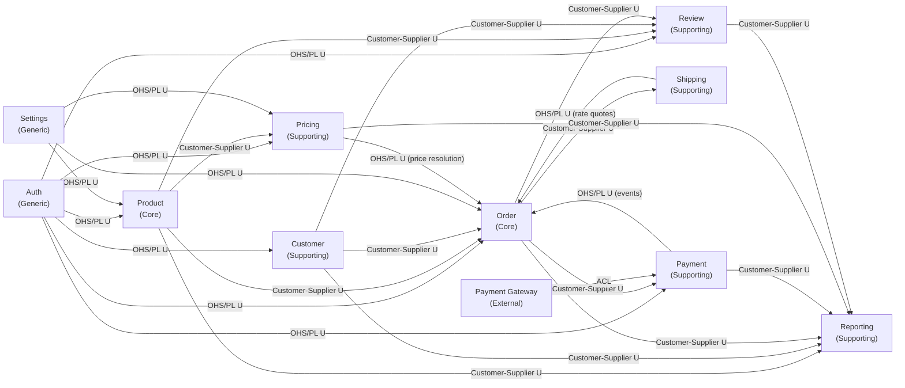

# OctaCart — Context Map

> Generated by bcdiscovery skill — 2026-08-23
> Updated: 2026-09-12 — Pricing, Customer (Wishlist), Order (Cart internal), Review, Payment BCs discovered

## Integration Patterns Summary

| Upstream (U) | Downstream (D) | Pattern | Notes |
|---|---|---|---|
| Auth | Product | OHS / Published Language | JWT claims provide admin/user identity (single-seller platform; no sellerId scoping) |
| Auth | Order | OHS / Published Language | JWT claims provide customerId to Order |
| Auth | Customer | OHS / Published Language | Identity provider for Customer profile |
| Auth | Payment | OHS / Published Language | Admin identity for payment/refund endpoints |
| Auth | Pricing | OHS / Published Language | Admin identity gates promotion/coupon management APIs |
| Auth | Review | OHS / Published Language | Shopper and admin identity for review submission and moderation |
| Product | Order | Customer–Supplier | Order reads product/variant/stock from Product; consumes VariantPriceChanged & StockAdjusted events |
| Product | Pricing | Customer–Supplier | Pricing reads variant base prices and categoryIds via VariantPricePort; consumes VariantPriceChanged |
| Product | Reporting | Customer–Supplier | Reporting consumes ProductPublished, StockAdjusted events |
| Product | Review | Customer–Supplier | Review stores productId reference; Order verification uses productId to check purchase |
| Customer | Order | Customer–Supplier | Order calls GetAddressSnapshot(customerId) at checkout; Customer exposes immutable AddressSnapshot |
| Customer | Reporting | Customer–Supplier | Reporting consumes CustomerRegistered, AccountDeactivated events |
| Customer | Review | Customer–Supplier | Review stores customerId reference; one review per customer per product enforced by Review BC |
| Order | Payment | Customer–Supplier | Order triggers InitiatePayment with orderId + grandTotal; Payment is downstream |
| Order | Shipping | Customer–Supplier | Order publishes OrderFulfilled; Shipping creates the shipment |
| Order | Reporting | Customer–Supplier | Reporting consumes OrderPlaced, OrderPaid, OrderFulfilled, OrderCancelled events |
| Order | Review | Customer–Supplier | Review uses OrderVerificationPort to check HasDeliveredOrderForProduct for verified-purchase tagging |
| Shipping | Order | OHS / Published Language | Shipping quotes delivery rates to Order at checkout (stable ShippingQuote shape) |
| Payment | Order | OHS / Published Language | Payment publishes PaymentCaptured/Failed events consumed by Order (stable event contract) |
| Payment | Reporting | Customer–Supplier | Reporting consumes PaymentCaptured, PaymentFailed, RefundIssued events |
| Gateway | Payment | ACL | StripeGatewayAdapter (or equivalent) translates between OctaCart Payment model and gateway API |
| Settings | Product | OHS / Published Language | Currency, tax, and store-level config consumed by Product |
| Settings | Order | OHS / Published Language | Currency and tax rules consumed by Order |
| Settings | Pricing | OHS / Published Language | Currency code and jurisdiction defaults consumed by Pricing |
| Pricing | Order | OHS / Published Language | Pricing exposes stable ResolvePrice / ResolveCart / ApplyCoupon contract consumed at checkout |
| Pricing | Reporting | Customer–Supplier | Reporting consumes PromotionExpired, CouponRedeemed events |
| Review | Reporting | Customer–Supplier | Reporting consumes ReviewPublished, ReviewRejected events |

## Key Polysemes (Cross-Context Term Conflicts)

| Term | Auth | Customer | Product | Pricing | Order | Shipping | Payment | Review |
|---|---|---|---|---|---|---|---|---|
| `Customer` | Authenticated principal with claims/lockout | Shopper with profile, address book, preferences | Not a concept | Not a concept | Party placing and owning an order | Not a concept | Not a concept | Author of a review (customerId reference only) |
| `Address` | Not a concept | Editable address-book entry | Not a concept | Not a concept | Billing/shipping snapshot locked at checkout | Immutable parcel destination snapshot | Not a concept | Not a concept |
| `Status` | Not a concept | CustomerStatus (Active/Deactivated) | ProductStatus (Draft/Active/Archived) | PromoStatus (Draft/Active/Expired/Paused) | OrderStatus (Pending..Delivered) | ShipmentStatus (Pending..Returned) | PaymentStatus (Initiated/Captured/Failed/Refunded) | ReviewStatus (Submitted/Published/Rejected/Withdrawn) |
| `Method` | Not a concept | Not a concept | Not a concept | Not a concept | Not a concept | Delivery option (ShippingMethod) | Payment instrument or gateway method | Not a concept |
| `Price` | Not a concept | Not a concept | Current display/sell price on a variant | Computed effective unit price | Immutable price snapshot at purchase | Not a concept | Transaction amount (Money) | Not a concept |
| `Discount` | Not a concept | Not a concept | Not a concept | Rule-driven reduction during price resolution | Line-level reduction locked into order | Not a concept | Not a concept | Not a concept |
| `Email` | Login credential for form auth | Contact/display email on profile | Not a concept | Not a concept | Not a concept | Not a concept | Not a concept | Not a concept |
| `Rating` | Not a concept | Not a concept | Not a concept | Not a concept | Not a concept | Not a concept | Not a concept | Integer 1-5 stars on a Review |

## Open Questions (Needs Human)

- **Stock reservation model**: sync `ReserveStock` call vs. async event from Order to Product
- **Event bus mechanism**: in-process function call vs. message broker (NATS/Kafka) — affects all Customer-Supplier relationships
- **Fulfillment trigger** (Shipping, 2026-08-26): auto-shipment on OrderFulfilled/PaymentCaptured vs manual seller action — see `.agents/discover/shipping.md`
- **Carrier scope v1** (Shipping, 2026-08-26): manual carriers only vs courier API integration
- **Returns ownership** (Shipping, 2026-08-26): RMA in Shipping with refunds in Payment, or RMA in Order
- **Pricing — Promotion overlap policy** (Pricing, 2026-09-12): best-wins, sum, or explicit stackable flag — see `.agents/discover/pricing/domain-model.md`
- **Pricing — Tax inclusion model** (Pricing, 2026-09-12): tax-inclusive prices vs tax added at checkout
- **Pricing — Tax jurisdiction** (Pricing, 2026-09-12): flat rate vs category/destination-specific
- **Pricing — VariantPriceChanged migration** (Pricing, 2026-09-12): Order stops consuming this event and relies on Pricing.ResolvePrice?
- **Pricing — compareAtPrice ownership** (Pricing, 2026-09-12): stays in Product BC or moves to Pricing?
- **Customer — Name/Email duplication** (Customer, 2026-09-12): move from Auth.User to Customer exclusively? — see `.agents/discover/customer/domain-model.md`
- **Customer — Registration trigger** (Customer, 2026-09-12): sync in-handler vs async UserCreated event
- **Customer — DeleteAddress guard** (Customer, 2026-09-12): block unconditionally or only when open orders exist?
- **Customer — Guest checkout** (Customer, 2026-09-12): registration mandatory or guest orders (null customerId) allowed?
- **Customer — Contact email vs. login email** (Customer, 2026-09-12): always the same or independently updatable?
- **Order — Guest cart merge strategy** (Order, 2026-09-12): conflict resolution on login — see `.agents/discover/order/domain-model.md`
- **Order — Stock reservation model** (Order, 2026-09-12): synchronous ReserveStock vs optimistic check
- **Order — Refund initiation** (Order, 2026-09-12): sync Payment.Refund call or async OrderCancelled event?
- **Order — Cart expiry** (Order, 2026-09-12): auto-expire inactive carts (TTL / background job)?
- **Order — VariantPriceChanged cart handling** (Order, 2026-09-12): silent update, warning, or force re-confirmation?
- **Payment — Gateway for v1** (Payment, 2026-09-12): Stripe, Razorpay, COD, or other? — see `.agents/discover/payment/domain-model.md`
- **Payment — Initiation trigger** (Payment, 2026-09-12): sync call from Order.CheckoutSvc or async reaction to OrderPlaced event?
- **Payment — Multi-attempt payments** (Payment, 2026-09-12): can shopper retry after a failed payment on the same order?
- **Payment — Partial refunds in v1** (Payment, 2026-09-12): affects RefundAmountValidator and PartiallyRefunded status
- **Review — Verified purchase mandatory** (Review, 2026-09-12): must shopper have delivered order, or are unverified reviews allowed? — see `.agents/discover/review/domain-model.md`
- **Review — Moderation policy** (Review, 2026-09-12): auto-approve all, auto-approve verified-purchase only, or full manual queue?
- **Review — ReviewVote (helpful/not helpful)** (Review, 2026-09-12): in scope for v1?
- **Review — Edit window after publishing** (Review, 2026-09-12): can a published review be edited (forces back to Submitted)?

## Architecture Baseline Decisions
- **Multi-seller scope**: Single-seller / single-admin platform across all bounded contexts (no seller tenant scoping required).
- **Cart is internal to Order BC**: Cart is the pre-order state; not a separate BC. Cart -> Checkout -> Order is one lifecycle inside Order BC.
- **Tax and Discount owned by Pricing BC**: Pricing computes tax and applies discounts; Order stores only the resulting Money snapshots (taxAmount, discountAmount) on OrderLine.
- **Reviews are a separate Supporting BC**: Review cross-cuts Product, Customer, and Order via foreign-key references only; no shared tables.
- **Payment Gateway behind ACL**: The StripeGatewayAdapter (or equivalent) is the only place that knows the gateway API; swappable without touching PaymentSvc.
