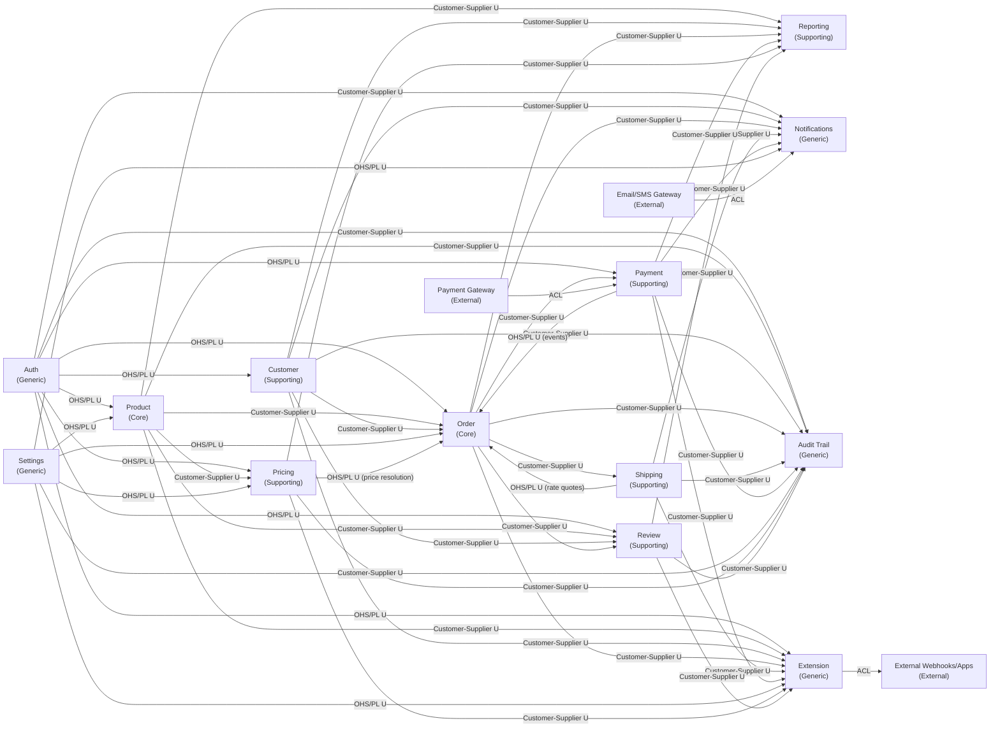

# OctaCart — Context Map

> Generated by bcdiscovery skill — 2026-08-23
> Updated: 2026-09-16 — Multi-store shopId scoping added across all BCs; Settings and Reporting BCs discovered

## Integration Patterns Summary

| Upstream (U) | Downstream (D) | Pattern | Notes |
|---|---|---|---|
| Auth | Product | OHS / Published Language | JWT claims provide admin/user identity (single-seller platform; no sellerId scoping) |
| Auth | Order | OHS / Published Language | JWT claims provide customerId to Order |
| Auth | Customer | OHS / Published Language | Identity provider for Customer profile |
| Auth | Payment | OHS / Published Language | Admin identity for payment/refund endpoints |
| Auth | Pricing | OHS / Published Language | Admin identity gates promotion/coupon management APIs |
| Auth | Review | OHS / Published Language | Shopper and admin identity for review submission and moderation |
| Auth | Notifications | Customer–Supplier | Consumes password reset and security alert triggers |
| Auth | Audit Trail | Customer–Supplier | Consumes user creation, role changes, lockout events |
| Auth | Extension | OHS / Published Language | Validates admin permissions to install/configure extensions |
| Product | Order | Customer–Supplier | Order reads product/variant/stock from Product; consumes VariantPriceChanged & StockAdjusted events |
| Product | Pricing | Customer–Supplier | Pricing reads variant base prices and categoryIds via VariantPricePort; consumes VariantPriceChanged |
| Product | Reporting | Customer–Supplier | Reporting consumes ProductPublished, StockAdjusted events |
| Product | Review | Customer–Supplier | Review stores productId reference; Order verification uses productId to check purchase |
| Product | Audit Trail | Customer–Supplier | Ingests product creation, publication, variant archiving, stock adjustments |
| Product | Extension | Customer–Supplier | Extension dispatches product-related webhooks on catalog mutations |
| Customer | Order | Customer–Supplier | Order calls GetAddressSnapshot(customerId) at checkout; Customer exposes immutable AddressSnapshot |
| Customer | Reporting | Customer–Supplier | Reporting consumes CustomerRegistered, AccountDeactivated events |
| Customer | Review | Customer–Supplier | Review stores customerId reference; one review per customer per product enforced by Review BC |
| Customer | Notifications | Customer–Supplier | Notifications consumes CustomerRegistered for welcome emails |
| Customer | Audit Trail | Customer–Supplier | Ingests account deactivations, reactivations |
| Customer | Extension | Customer–Supplier | Extension dispatches customer registration and profile webhooks |
| Order | Payment | Customer–Supplier | Order triggers InitiatePayment with orderId + grandTotal; Payment is downstream |
| Order | Shipping | Customer–Supplier | Order publishes OrderFulfilled; Shipping creates the shipment |
| Order | Reporting | Customer–Supplier | Reporting consumes OrderPlaced, OrderPaid, OrderFulfilled, OrderCancelled events |
| Order | Review | Customer–Supplier | Review uses OrderVerificationPort to check HasDeliveredOrderForProduct for verified-purchase tagging |
| Order | Notifications | Customer–Supplier | Notifications consumes OrderPlaced, OrderCancelled to notify shopper/admin |
| Order | Audit Trail | Customer–Supplier | Ingests order status overrides, cancellations |
| Order | Extension | Customer–Supplier | Extension dispatches order creation, fulfillment, and cancellation webhooks |
| Shipping | Order | OHS / Published Language | Shipping quotes delivery rates to Order at checkout (stable ShippingQuote shape) |
| Shipping | Notifications | Customer–Supplier | Notifications consumes ShipmentDispatched, ShipmentDelivered, DeliveryFailed events |
| Shipping | Audit Trail | Customer–Supplier | Ingests manual carrier status overrides and dispatch events |
| Shipping | Extension | Customer–Supplier | Extension dispatches tracking updates and shipment webhooks |
| Payment | Order | OHS / Published Language | Payment publishes PaymentCaptured/Failed events consumed by Order (stable event contract) |
| Payment | Reporting | Customer–Supplier | Reporting consumes PaymentCaptured, PaymentFailed, RefundIssued events |
| Payment | Notifications | Customer–Supplier | Notifications consumes PaymentCaptured, RefundIssued for receipt emails |
| Payment | Audit Trail | Customer–Supplier | Ingests payment capture and refund transactions |
| Payment | Extension | Customer–Supplier | Extension dispatches payment capture and refund webhooks |
| Gateway | Payment | ACL | StripeGatewayAdapter (or equivalent) translates between OctaCart Payment model and gateway API |
| Settings | Product | OHS / Published Language | Currency, tax, and store-level config consumed by Product |
| Settings | Order | OHS / Published Language | Currency and tax rules consumed by Order |
| Settings | Pricing | OHS / Published Language | Currency code and jurisdiction defaults consumed by Pricing |
| Settings | Notifications | OHS / Published Language | Store sender email, company name, and support links consumed by Notifications |
| Settings | Audit Trail | Customer–Supplier | Ingests store configuration changes |
| Settings | Extension | OHS / Published Language | Store domain URL and identity details consumed by Extension |
| Pricing | Order | OHS / Published Language | Pricing exposes stable ResolvePrice / ResolveCart / ApplyCoupon contract consumed at checkout |
| Pricing | Reporting | Customer–Supplier | Reporting consumes PromotionExpired, CouponRedeemed events |
| Pricing | Audit Trail | Customer–Supplier | Ingests promotion rules creation, coupon generation/edits |
| Pricing | Extension | Customer–Supplier | Extension dispatches promotion and coupon lifecycle webhooks |
| Review | Reporting | Customer–Supplier | Reporting consumes ReviewPublished, ReviewRejected events |
| Review | Audit Trail | Customer–Supplier | Ingests admin moderation decisions (published/rejected) |
| Review | Extension | Customer–Supplier | Extension dispatches review published/moderated webhooks |
| MailProvider | Notifications | ACL | Adapter (SMTP / SES / Resend) translates notification requests to provider API/protocol |
| Extension | ExternalWebhooks | ACL | Webhook client dispatches signed HMAC payloads to external webhooks with retry/backoff |

## Key Polysemes (Cross-Context Term Conflicts)

| Term | Auth | Customer | Product | Pricing | Order | Shipping | Payment | Review | Notifications | Audit Trail | Extension |
|---|---|---|---|---|---|---|---|---|---|---|---|
| `Customer` | Authenticated principal with claims/lockout | Shopper with profile, address book, preferences | Not a concept | Not a concept | Party placing and owning an order | Not a concept | Not a concept | Author of a review | Recipient of communications | Actor or subject of audited profile changes | Not a concept |
| `Address` | Not a concept | Editable address-book entry | Not a concept | Not a concept | Billing/shipping snapshot locked at checkout | Immutable parcel destination snapshot | Not a concept | Not a concept | Email address / phone number destination | IP Address of the acting client | Target webhook endpoint URL |
| `Status` | Not a concept | CustomerStatus (Active/Deactivated) | ProductStatus (Draft/Active/Archived) | PromoStatus (Draft/Active/Expired/Paused) | OrderStatus (Pending..Delivered) | ShipmentStatus (Pending..Returned) | PaymentStatus (Initiated/Captured/Failed/Refunded) | ReviewStatus (Submitted/Published/Rejected/Withdrawn) | NotificationStatus (Pending/Sending/Sent/Failed) | Not a concept | ExtensionStatus / WebhookStatus |
| `Method` | Not a concept | Not a concept | Not a concept | Not a concept | Not a concept | Delivery option (ShippingMethod) | Payment instrument or gateway method | Not a concept | Not a concept | Not a concept | HTTP Request Method (POST/GET) |
| `Price` | Not a concept | Not a concept | Current display/sell price on a variant | Computed effective unit price | Immutable price snapshot at purchase | Not a concept | Transaction amount (Money) | Not a concept | Not a concept | Audited attribute value | Not a concept |
| `Discount` | Not a concept | Not a concept | Not a concept | Rule-driven reduction during price resolution | Line-level reduction locked into order | Not a concept | Not a concept | Not a concept | Not a concept | Audited entity or field | Not a concept |
| `Email` | Login credential for form auth | Contact/display email on profile | Not a concept | Not a concept | Not a concept | Not a concept | Not a concept | Not a concept | Delivery channel or destination | Not a concept | Not a concept |
| `Rating` | Not a concept | Not a concept | Not a concept | Not a concept | Not a concept | Not a concept | Not a concept | Integer 1-5 stars on a Review | Not a concept | Not a concept | Not a concept |
| `Template` | Not a concept | Not a concept | Not a concept | Not a concept | Not a concept | Not a concept | Not a concept | Not a concept | Parameterized message layout | Not a concept | Not a concept |
| `Action` | Not a concept | Not a concept | Not a concept | Not a concept | Not a concept | Not a concept | Not a concept | Not a concept | Not a concept | Standardized mutation verb | Not a concept |
| `Hook` | Not a concept | Not a concept | Not a concept | Not a concept | Not a concept | Not a concept | Not a concept | Not a concept | Not a concept | Not a concept | Platform extension point or webhook trigger |

## Open Questions (Needs Human)

- **Stock reservation model**: sync `ReserveStock` call vs. async event from Order to Product
- **Event bus mechanism**: in-process function call vs. message broker (NATS/Kafka) — affects all Customer-Supplier relationships
- **Fulfillment trigger** (Shipping, 2026-08-26): auto-shipment on OrderFulfilled/PaymentCaptured vs manual seller action — see `.agents/discover/shipping.md`
- **Carrier scope v1** (Shipping, 2026-08-26): manual carriers only vs courier API integration
- **Returns ownership** (Shipping, 2026-08-26): RMA in Shipping with refunds in Payment, or RMA in Order
- **Pricing — Promotion overlap policy** (Pricing, 2026-09-12): best-wins, sum, or explicit stackable flag — see `.agents/discover/pricing/domain-model.md`
- **Pricing — Tax inclusion model** (Pricing, 2026-09-12): tax-inclusive prices vs tax added at checkout
- **Pricing — Tax jurisdiction** (Pricing, 2026-09-12): flat rate vs category/destination-specific
- **Pricing — VariantPriceChanged migration** (Pricing, 2026-09-12): Order stops consuming this event and relies on Pricing.ResolvePrice?
- **Pricing — compareAtPrice ownership** (Pricing, 2026-09-12): stays in Product BC or moves to Pricing?
- **Customer — Name/Email duplication** (Customer, 2026-09-12): move from Auth.User to Customer exclusively? — see `.agents/discover/customer/domain-model.md`
- **Customer — Registration trigger** (Customer, 2026-09-12): sync in-handler vs async UserCreated event
- **Customer — DeleteAddress guard** (Customer, 2026-09-12): block unconditionally or only when open orders exist?
- **Customer — Guest checkout** (Customer, 2026-09-12): registration mandatory or guest orders (null customerId) allowed?
- **Customer — Contact email vs. login email** (Customer, 2026-09-12): always the same or independently updatable?
- **Order — Guest cart merge strategy** (Order, 2026-09-12): conflict resolution on login — see `.agents/discover/order/domain-model.md`
- **Order — Stock reservation model** (Order, 2026-09-12): synchronous ReserveStock vs optimistic check
- **Order — Refund initiation** (Order, 2026-09-12): sync Payment.Refund call or async OrderCancelled event?
- **Order — Cart expiry** (Order, 2026-09-12): auto-expire inactive carts (TTL / background job)?
- **Order — VariantPriceChanged cart handling** (Order, 2026-09-12): silent update, warning, or force re-confirmation?
- **Payment — Gateway for v1** (Payment, 2026-09-12): Stripe, Razorpay, COD, or other? — see `.agents/discover/payment/domain-model.md`
- **Payment — Initiation trigger** (Payment, 2026-09-12): sync call from Order.CheckoutSvc or async reaction to OrderPlaced event?
- **Payment — Multi-attempt payments** (Payment, 2026-09-12): can shopper retry after a failed payment on the same order?
- **Payment — Partial refunds in v1** (Payment, 2026-09-12): affects RefundAmountValidator and PartiallyRefunded status
- **Review — Verified purchase mandatory** (Review, 2026-09-12): must shopper have delivered order, or are unverified reviews allowed? — see `.agents/discover/review/domain-model.md`
- **Review — Moderation policy** (Review, 2026-09-12): auto-approve all, auto-approve verified-purchase only, or full manual queue?
- **Review — ReviewVote (helpful/not helpful)** (Review, 2026-09-12): in scope for v1?
- **Review — Edit window after publishing** (Review, 2026-09-12): can a published review be edited (forces back to Submitted)?
- **Notifications — Delivery dispatch model** (Notifications, 2026-09-15): synchronous execution vs in-process worker queue with goroutines
- **Notifications — Template storage** (Notifications, 2026-09-15): embedded Go templates vs database editable templates
- **Notifications — Default email provider for V1** (Notifications, 2026-09-15): standard SMTP, local log printer mock, or cloud provider (SES/Resend)
- **Audit Trail — Ingestion mechanism in V1** (Audit Trail, 2026-09-15): domain events via event bus vs direct AuditRecorder port calls from app services
- **Audit Trail — Payload granularity** (Audit Trail, 2026-09-15): full entity snapshots vs modified delta fields in ChangeSet
- **Audit Trail — Retention policy** (Audit Trail, 2026-09-15): indefinite retention vs TTL pruning (90/365 days)
- **Audit Trail — Shopper action auditing** (Audit Trail, 2026-09-15): restrict to Admin/System actions vs including shopper mutations (profile, addresses)
- **Extension — Execution model for V1** (Extension, 2026-09-15): out-of-process HTTP webhooks & API credentials vs in-process plugins / WASM
- **Extension — Synchronous blocking hooks** (Extension, 2026-09-15): allow synchronous interception of checkout/pricing or strictly asynchronous webhooks
- **Extension — Delivery log retention** (Extension, 2026-09-15): max retries and retention window for webhook delivery logs
- **Multi-store scoping model** (2026-09-16): shopId-based shared-database tenancy adopted. Each BC carries shopId on aggregates and repo queries. Auth BC unchanged. Customers are per-store. Silo (per-instance) model rejected.

## Architecture Baseline Decisions
- **Multi-store scope**: A single merchant can own and operate multiple stores. All catalog, order, customer, pricing, shipping, payment, review, notifications, audit trail, and extension data is scoped by `shopId`. Auth BC is unchanged — it manages merchant identity globally; shopId is a claim embedded in the JWT after the merchant selects a store. Customers are per-store (not shared across stores). shopId is a string passed through request context (middleware) on the driving adapter side and threaded through application service calls as a mandatory parameter. No BC owns or validates shopId — it is the Auth BC's responsibility.
- **Cart is internal to Order BC**: Cart is the pre-order state; not a separate BC. Cart -> Checkout -> Order is one lifecycle inside Order BC.
- **Tax and Discount owned by Pricing BC**: Pricing computes tax and applies discounts; Order stores only the resulting Money snapshots (taxAmount, discountAmount) on OrderLine.
- **Reviews are a separate Supporting BC**: Review cross-cuts Product, Customer, and Order via foreign-key references only; no shared tables.
- **Payment Gateway behind ACL**: The StripeGatewayAdapter (or equivalent) is the only place that knows the gateway API; swappable without touching PaymentSvc.
- **Notifications is a Generic BC behind ACL**: Third-party email/SMS provider protocols are insulated behind provider adapters; all business communications are triggered asynchronously or via coarse-grained event consumption.
- **Audit Trail is an Append-Only Generic BC**: Strictly isolates compliance and administrative audit records from ephemeral runtime logs (Zerolog) and mutable operational tables.
- **Extension is a Generic Extensibility BC**: Governs third-party plugins, manifest configurations, security scopes, and signed webhook deliveries isolated from core transactional code.
