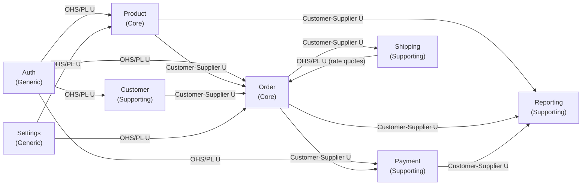

# OctaCart — Context Map

> Generated by bcdiscovery skill — 2026-08-23

## Integration Patterns Summary

| Upstream (U) | Downstream (D) | Pattern | Notes |
|---|---|---|---|
| Auth | Product | OHS / Published Language | JWT claims provide sellerId to Product |
| Auth | Order | OHS / Published Language | JWT claims provide customerId to Order |
| Auth | Customer | OHS / Published Language | Identity provider for Customer profile |
| Auth | Payment | OHS / Published Language | Auth context for payment initiation |
| Product | Order | Customer–Supplier | Order reads product/variant/stock from Product; Product does not depend on Order |
| Product | Reporting | Customer–Supplier | Reporting consumes ProductPublished, StockAdjusted events |
| Customer | Order | Customer–Supplier | Order reads customer shipping/billing address from Customer |
| Order | Payment | Customer–Supplier | Payment processes order totals; Order initiates payment |
| Order | Shipping | Customer–Supplier | Shipping receives fulfilled order data to dispatch |
| Shipping | Order | OHS / Published Language | Shipping quotes delivery rates to Order at checkout (stable `ShippingQuote` shape) |
| Order | Reporting | Customer–Supplier | Reporting consumes OrderPlaced, OrderFulfilled events |
| Payment | Reporting | Customer–Supplier | Reporting consumes PaymentCaptured, PaymentRefunded events |
| Settings | Product | OHS / Published Language | Currency, tax, and store-level config consumed by Product |
| Settings | Order | OHS / Published Language | Currency and tax rules consumed by Order |

## Key Polysemes (Cross-Context Term Conflicts)

| Term | Product context | Order context |
|---|---|---|
| `Price` | Current display/sell price on a variant | Immutable price captured at time of purchase |
| `Stock` | Current quantity on hand | Availability at time order was placed |
| `Customer` | Not a concept (uses sellerId/UserId) | The shopper placing the order |
| `Address` | Not a concept | Shipping: immutable destination snapshot on a shipment (Customer owns the editable address book) |

## Open Questions (Needs Human)

- **Stock reservation model**: sync `ReserveStock` call vs. async event from Order to Product
- **Event bus mechanism**: in-process function call vs. message broker (NATS/Kafka) — affects all Customer-Supplier relationships
- **Multi-seller scope**: single-seller platform or marketplace — affects Product, Order, and Customer boundaries
- **Fulfillment trigger** (Shipping, 2026-08-26): auto-shipment on OrderFulfilled/PaymentCaptured vs manual seller action — see `.agents/discover/shipping.md`
- **Carrier scope v1** (Shipping, 2026-08-26): manual carriers only vs courier API integration; zone-based rates vs live carrier rates
- **Returns ownership** (Shipping, 2026-08-26): RMA in Shipping (reverse-parcel logistics) with refunds in Payment, or RMA in Order
