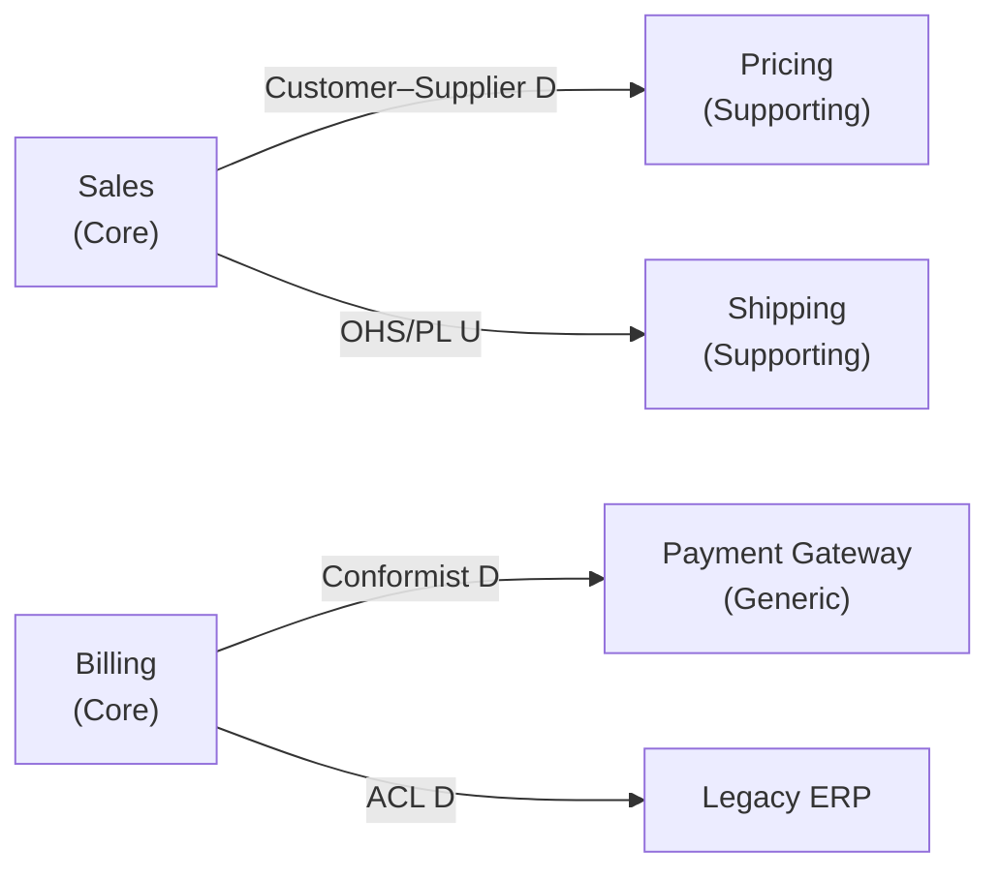

# Bounded Context Discovery (BC)

Systematically discover, define, and validate bounded contexts in a domain — for greenfield modeling, monolith decomposition, or aligning architecture with the business domain.

## When to Use This Skill

- Designing a new system and need to carve the domain into bounded contexts
- Decomposing a monolith into modules or services
- Ambiguous or conflicting domain language is causing design friction

## Core Concepts (Quick Reference)

- **Bounded context**: an explicit boundary inside which a domain model and its language are consistent and unified. The same term may mean different things in different contexts — that is expected and healthy.
- **Ubiquitous language**: the shared vocabulary of one context, used by domain experts and code alike.
- **Context map**: a diagram of contexts and the integration patterns between them.

## Inputs to Gather First

For each question in the Interview Question Bank, attempt to answer it yourself first.

- **[Inferred]** — answered from available artifacts; state the evidence
- **[Assumed]** — no direct evidence; state the assumption explicitly and proceed
- **[Needs Human]** — cannot be reliably inferred (typically: polysemes, data ownership disputes, org/team boundaries, "what almost never changes")

Proceed through the workflow using [Inferred] and [Assumed] answers. Collect all [Needs Human] items into a single question list and present it to the user at natural checkpoints (end of Step 1 and Step 5) rather than blocking immediately — this lets the agent make maximum progress autonomously while still surfacing what it genuinely can't know.

## Discovery Workflow

Work through these steps in order. Write each context's findings to .agents/discover/{bc}.md, and the final context map to .agents/discover/context-map.md.

### Step 1 — Map the Domain at a High Level

- Identify the major business capabilities and end-to-end flows (e.g., "a customer places an order and receives it").
- List actors, external systems, and key business processes.
- For brownfield: Read the AGENTS.md for coding styles.
- For greenfield: work from the product brief, feature list, or users description; draw on known patterns for similar domains, and mark these as [Inferred]."

### Step 2 — Surface Domain Events and Commands

Run a lightweight Event Storming pass:

- **Domain events**: things that happen, phrased in past tense (`Order Placed`, `Payment Failed`, `Shipment Dispatched`).
- **Commands**: the intentions that trigger events (`Place Order`, `Refund Payment`).
- **Actors/systems** that issue commands.

Arrange events into timelines per business flow. Do not design yet — just harvest.

### Step 3 — Cluster into Candidate Contexts

Group events, commands, and concepts into candidate contexts using the boundary heuristics below. Prefer 2-4 candidates for a first pass; merge or split later.

### Step 4 — Name and Classify Each Context

- Name in domain language: a noun or noun phrase (`Catalog`, `Billing`, `Fraud Detection`). Never technical names (`OrderManager`, `CommonService`).
- Classify strategically:
  - **Core** — competitive advantage; invest here
  - **Supporting** — business-specific but not differentiating
  - **Generic** — commodity; buy or reuse (auth, notifications)

### Step 5 — Define the Ubiquitous Language per Context

- Build a glossary of the 5–15 key terms per context.
- Explicitly flag **polysemes** — terms with different meanings across contexts (e.g., `Customer` in Sales = lead/opportunity; in Support = ticket requester; in Billing = invoice recipient). These are the strongest evidence a boundary is real.

### Step 6 — Map Relationships Between Contexts

For each pair of interacting contexts, identify the integration pattern and direction (upstream `U` / downstream `D`):

| Pattern | Meaning |
|---|---|
| Partnership | Two contexts evolve together, coordinated |
| Shared Kernel | Small explicitly shared model, jointly owned |
| Customer–Supplier | Upstream serves downstream's needs |
| Conformist | Downstream adopts upstream's model as-is |
| Anticorruption Layer (ACL) | Downstream translates to protect its model |
| Open Host Service (OHS) / Published Language (PL) | Upstream exposes a stable, documented protocol |
| Separate Ways | No integration; duplicated capability is fine |

### Step 7 — Validate the Boundaries

Walk 2–3 critical end-to-end scenarios across the candidate map. For each context, check:

- [ ] A single team could own it
- [ ] It owns its data exclusively (no shared writable tables)
- [ ] Its language is internally consistent
- [ ] Cross-context calls are coarse-grained, not chatty
- [ ] It can change internally without forcing changes elsewhere
- [ ] Each boundary is justified by at least one heuristic (language, ownership, rate of change, etc.) — not by technical layer

If a check fails, merge, split, or redraw the boundary and re-validate.

### Step 8 — Document the Result

Produce one Bounded Context Canvas per context plus a single context map (templates below).
Write the context map to .agents/discover/context-map.md

## Boundary Heuristics Cheat Sheet

| Signal | What it suggests |
|---|---|
| Same word, different meaning | Strong boundary — separate models |
| Different domain experts own the concepts | Likely boundary |
| Different rates of change | Boundary lets them evolve independently |
| Different consistency/transaction needs | Boundary (e.g., catalog browsing vs. payment) |
| Different scaling or availability needs | Candidate boundary |
| Data written by exactly one cluster | Data-ownership boundary — respect it |
| Organizational/team ownership (Conway) | Align boundaries with team cognitive load |
| Regulatory/security perimeter | Hard boundary (e.g., PII, PCI scope) |
| Workflow handoff between roles | Often a context seam |

## Anti-Patterns to Avoid

- **Entity-based splitting**: one context per noun (`OrderContext`, `CustomerContext`) — produces anemic CRUD silos and chatty coupling
- **Shared database** across contexts — the boundary is fake
- **Layer-following boundaries** (Web / Business / Data) — those are technical tiers, not contexts
- **Nano-contexts**: dozens of tiny contexts; integration cost exceeds autonomy value
- **"Common" / "Shared" contexts** full of everyone's leftovers — that's a Big Ball of Mud with a nice name

## Interview Question Bank

Consider following questions ask yourself as a domain expert.

- Walk me through what happens, start to finish, when \<key business event\> occurs.
- What words do you use that other departments use differently?
- What reports or decisions does your part of the business need that others don't?
- What changes most often? What almost never changes?
- What would break if \<system/module\> were down for a day?
- Who owns this data? Who is allowed to change it?
- Where do you have to translate or re-enter information between teams or systems?

## Output Templates

### Bounded Context Canvas (one per context)

```markdown
## Bounded Context: <Name>

- **Purpose**: <one or two sentences — what business capability it provides>
- **Classification**: Core | Supporting | Generic

### Entities

- Domain Entity 1 - <List the main properties>
- Domain Entity 2 etc

### Value Types

- Value type - Brief description

### Application services

- Application service1
  - <summary of the main usecases exposed>
  - Errors that are returned

### Domain Services

- Domain service 1 - <summary of service and involved entities>

### Adapters

Any adapters needed.

### Ubiquitous Language
| Term | Definition |
|---|---|
| <term> | <meaning in THIS context> |

### Capabilities
- <responsibility 1>
- <responsibility 2>

### Inbound
- Commands handled: <...>
- Events consumed: <from context — event>

### Outbound
- Events published: <...>
- APIs / queries exposed: <...>

### Dependencies
- Upstream: <context — pattern>
- Downstream: <context — pattern>

### Data Owned
- <entities / aggregates / tables>

### Ambigous Questions Needed From Architect
- <assumptions, unresolved boundary decisions>
```

### Context Map (single diagram for the whole domain)



## Definition of Done

- Every candidate context has a completed canvas
- A context map shows all relationships with named patterns
- Polysemes are documented per context
- At least 2 end-to-end scenarios validated against the map
- The user has confirmed the boundaries make business sense